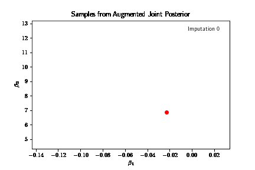
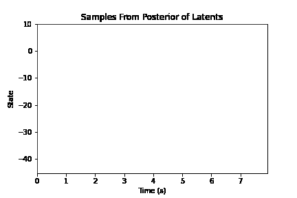

## Overview

This repository contains: (1) code and visuals implementing my statistical interests, (2) brief explanations of my current and planned computational neuroscience research, and (3) brief descriptions of my undergraduate math projects. This repository should give the reader an idea of what math I enjoy and would like to explore further. 

## Statistical interests

Several notebooks implement Markov Chain Monte Carlo (MCMC) methods. MCMC circumvents intractable expectations, estimating otherwise impossible quantities. I apply MCMC to [statistical mechanics](ising_model_mcmc/README.md), [cryptography](cipher_decoding/README.md), and [basic NP-hard](simulated_annealing/README.md) problems. 

Two notebooks implement latent variable methods. One employs [sequential importance resampling (SIR)](sequential_importance_resampling/README.md) to recover the latent dynamics of a toy state-space model. The other explores [data augmentation](data_augmentation/README.md) in simplifying an unwieldy posterior distribution, and better estimating a posterior given right-censored data (Tanner, 1996).

## Computational neuroscience

In addition to my [previous work](Miri_Lab_Research.pdf) at the [Miri Lab](https://www.mirilab.org), I have started to investigate state-space models for neural computation in "self-paced" decision making. Namely, I aim to uncover the latent dynamics underlying self-paced decision making in neural spike trains using a [Poisson Linear Dynamical System (PLDS) model](https://papers.nips.cc/paper_files/paper/2011/file/7143d7fbadfa4693b9eec507d9d37443-Paper.pdf). Similarly, I would like to compare the [diffusion-to-bound model to the switching model](https://www.cambridge.org/core/books/abs/advanced-state-space-methods-for-neural-and-clinical-data/estimating-state-and-parameters-in-state-space-models-of-spike-trains/FAB8634C2790F3461E3E86BB632EAE6F) and determine which best describes our data in a Bayesian framework.  

## Undergraduate math projects

Most notably, I explored rates of convergence for Markov chains with Dr. Ursula Porod (Associate Chair of Mathematics Department). We studied probabilistic and spectral methods for determining rates of convergence, specifically for random walks on permutation groups. Additionally, in the Directed Reading Program (DRP), my mentor and I proved major theorems in ergodic theory, and uncovered the isomorphic structure between the "doubling map" and binary expansions. With another mentor, I used Brownian motion to solve the Dirichlet problem for the heat equation. We coded simulations to find the temperature distribution on the interior of a domain given an initial temperature distribution on its boundary. 

## Please check out the notebooks above!

Hopefully, the reader will gain an understanding of what statistical and mathematical work interests me. I understand some of these problems are well studied, and there may be similar work out there. Nonetheless, solving these problems and writing the programs myself have been useful exercises. 

  
  
  
