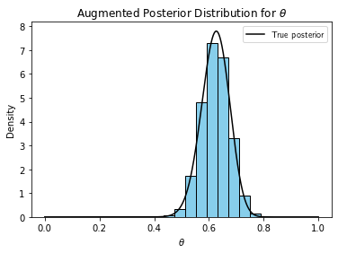
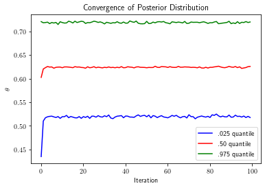
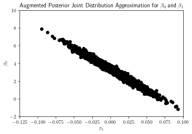
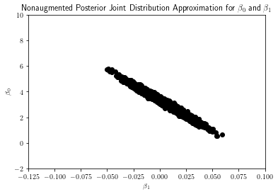
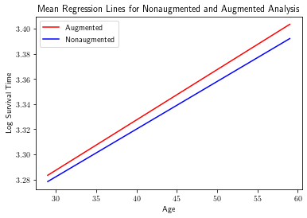
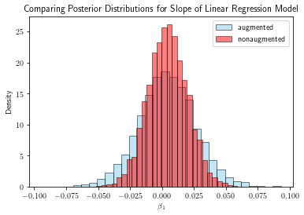
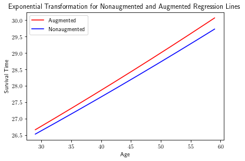
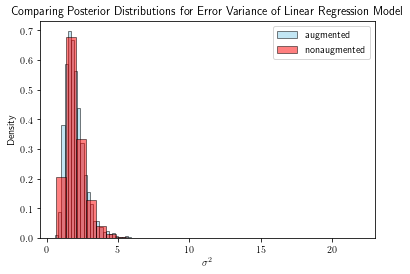

# Data augmentation

Test $Q^{*}$

The data augmentation algorithm serves two purposes: (1) to simplify the form of an intractable or unwieldy posterior distribution, or (2) better approximate the posterior in cases where we have "incomplete" data. Here, I demonstrate the former using an example adapted from Tanner, 1996. 

## Simplifying the form of a posterior distribution

As is the case for all implementations of data augmentation, we "complete" or augment the observed data with latent variables. Using both the observed and latent variables (the combination of which is referred to as augmented data), we update our approximation to the posterior distribution. We repeat these two steps until the posterior converges. A concrete example best demonstrates this process. 

We consider the genetic linkage model. Suppose 197 animals are distributed into four categories as follows: $$y = (y_{1}, y_{2}, y_{3}, y_{4}) = (125, 18, 20, 34)$$ with cell probabilities $$(\frac{1}{2} + \frac{\theta}{4}, \frac{1 - \theta}{4}, \frac{1 - \theta}{4}, \frac{\theta}{4}).$$ Under a flat prior, the posterior distribution is $$p(\theta | y) \propto (2 + \theta)^{y_{1}}(1 - \theta)^{y_{2} + y_{3}}\theta^{y_4}.$$ Evaluating expectations of this function might be too complex for our liking. We should sample it instead. However, we have no way to sample this distribution directly either. We can simplify its form with data augmentation. 

We augment the observed data $y$ with a latent variable $x$. We construct $x$ by spliting the first cell of $y$ into two cells. Specifically, $$y_{1} = x_{1} + x_{2}$$  $$y_{2} = x_{3}$$ $$y_{3} = x_{4}$$ $$y_{4} = x_{5}$$ where $x$ has cell probabilities $$(\frac{1}{2}, \frac{\theta}{4}, \frac{1 - \theta}{4}, \frac{1 - \theta}{4}, \frac{\theta}{4}).$$ Under a flat prior, the augmented posterior distribution is given by $$p(\theta | x) \propto \theta^{x_{2} + x_{5}}(1 - \theta)^{x_{3} + x_{4}}.$$ The augmented posterior admits a much simpler form. In fact, the augmented posterior is a beta distribution, which yields tractable expectations and direct sampling! But it depends on the latent variable $x_{2}$ which we have not observed yet. So, we must sample the conditional predictive distribution for $x_{2}$.
 
The conditional predictive distribution for $x_{2}$ is given by $$x_{2} \sim Binom(n = y_{1}, p = \frac{\theta}{\theta + 2}).$$ To be clear, $n$ is the number of counts in $y_{1}$, and $p$ is the probability that a count from $y_{1}$ falls in the $x_{2}$ cell. We compute $p$ by dividing the probability of being in $x_{2}$ by the probability of being in $y_{1}$. 

Thus, at each iteration of the algorithm, we generate $x_{2}^{(t)}$ from the current conditional predictive distribution where $$p = \frac{\theta_(t-1)^*}{\theta_(t-1)^* + 2}$$. Then, we update the posterior distribution by plugging in $x_{2}^{(t)}$ into the equation for $p(\theta | y)$. We sample $\theta^*_{t+1}$ from the corresponding beta distribution. We repeat this process until the algorithm converges. At that point, we have a sample from the desired posterior distribution!


```python
import numpy as np
import random
import matplotlib.pyplot as plt
from scipy.stats import norm

y1, y2, y3, y4 = [125, 18, 20, 34]

numIterations = 100
numImputations = 5000
posteriorApproximations = np.zeros([numIterations, numImputations])
randomIndices = random.choices(range(numImputations), k = numIterations)
currentTheta = np.random.uniform(0, 1, numImputations)

for iiIteration in range(numIterations):

    # Display every n'th iteration

    if iiIteration % 100 == 0:
        
        print('Iteration: ', iiIteration)

    # Generate m imputations / latent variables from the current posterior distribution (represented by a sample of thetas not just one theta)

    currentImputations = np.zeros([numImputations])

    for jjImputation in range(numImputations):

        thetaStar = currentTheta[jjImputation]
        currentImputations[jjImputation] = np.random.binomial(y1, thetaStar / (thetaStar + 2), 1)

    # Now sample theta star from Beta(v1, v2) where v1 = x2 + y4 + 1 and v2 = y2 + y3

    for jjImputation in range(numImputations):

        currentLatentVariable = currentImputations[random.randint(0, numImputations - 1)] # drawn from the conditional predictive distribution given the current approximation to the posterior
        currentTheta[jjImputation] = np.random.beta(currentLatentVariable + y4 + 1, y2 + y3 + 1, 1) # sampling the current approximation to the posterior
        # (which of course depends on the latent variables that in turn depend on the previous approximation to the posterior)
        posteriorApproximations[iiIteration, jjImputation] = currentTheta[jjImputation]

    if iiIteration == (numIterations - 1):

        print('Arrived at final approximation to the posterior distribution')


## Plot the true posterior distribution as well 
        
theta = np.linspace(0, 1, 10000)
trueDensity = ((2 + theta) ** y1) * ((1 - theta) ** (y2 + y3)) * (theta ** y4)

# Normalize the true density 

deltaTheta = theta[1] - theta[0]
normalizingConstant = np.sum(deltaTheta * trueDensity)
trueDensity = trueDensity / normalizingConstant

posteriorSample = currentTheta
plt.hist(posteriorSample, density = True, color = 'skyblue', edgecolor = 'black')
plt.plot(theta, trueDensity, color = 'black', label = 'True posterior')
print('Adding labels')
plt.rc('text', usetex = True)
plt.xlabel('$\\theta$')
plt.ylabel('Density')
plt.title('Augmented Posterior Distribution for $\\theta$')
plt.legend()
plt.show()

quantiles = np.array([.025, .50, .975])
convergenceQuantiles = np.quantile(posteriorApproximations, quantiles, axis = 1) 

```

    Iteration:  0
    Arrived at final approximation to the posterior distribution
    Adding labels


    

    


We can see that the sample from the augmented posterior agrees well with the true analytical posterior. We have made use of the fact that we can easily sample a simplified posterior distribution by augmenting the observed data with latent variables. We can also see that the posterior distribution converges in just a handful of iterations below. 


```python
colors = np.array(['blue', 'red', 'green'])
labels = np.array(['.025 quantile', '.50 quantile', '.975 quantile'])

for iiQuantile in range(len(quantiles)):

    plt.plot(convergenceQuantiles[iiQuantile, :], color = colors[iiQuantile], label = labels[iiQuantile])

plt.xlabel('Iteration')
plt.rc('text', usetex = True)
plt.ylabel('$\\theta$')
plt.title('Convergence of Posterior Distribution')
plt.legend()
plt.show()
```


    

    


## Better approximating posterior in case of right-censored data

Now, moving to the second application of data augmentation, I demonstrate how to better approximate a posterior in cases where we have "missing" or "incomplete" data.  

Our data set is comprised of descriptory statistics for patients who recently had heart transplants. These statistics include how long the patient survived after the heart transplant, and how old the patient was on the day of the transplant. We want to regress log survival time onto age. However, our data set is fairly incomplete: many patients did not die before the end of the study. Since we don't know the true value of their survival time (it will continue to change until they die), we can't incorporate this data into our regression. Using the data augmentation algorithm, we can fill in the missing data and incorporate it into our regression. In fact, we will be able to better approximate the joint posterior of the parameters of the linear regression model. The method and data are adapted from Tanner, 1996. We truncate the data intentionally to show the effects of data augmentation in a small sample setting. 

As explained previously, the algorithm works iteratively. To recap, at each iteration, we augment the observed (but incomplete) data by generating our best guess for the values of the missing data. In our case, we do so by generating the residuals for patients who survived longer than the length of the study, conditional on the fact that the residual must be more positive than what we currently observe. We then add these "imputed" residuals to the recorded log survival time to complete the data. Then, we are able to run our regression. Using the augmented data, we update the approximation to the posterior distribution. We repeat these steps until the posterior distribution converges. In the end, we have a sample from a better approximation to the posterior distribution. 


```python
## Import packages and set up parameters

import pandas as pd
import numpy as np
import random
from sklearn.linear_model import LinearRegression
import matplotlib.pyplot as plt

# np.random.seed(211) # For reproducibility
stanfordHeartData = pd.read_csv('heart_transplant.csv') # Load data in 

## Regressing log survival time on age to get sample variance of residuals

aliveIndices = stanfordHeartData.index[stanfordHeartData['survived'] == 'alive'].tolist()
deadIndices = stanfordHeartData.index[stanfordHeartData['survived'] == 'dead'].tolist()

# Truncate data
 
truncatedAlive = 28
truncatedDead = 20
aliveIndices = random.sample(aliveIndices, truncatedAlive)
deadIndices = random.sample(deadIndices, truncatedDead)
deadSurvivalTimes = stanfordHeartData['survtime'][deadIndices]
logDeadSurvivalTimes = np.array(np.log(deadSurvivalTimes))
deadAge = np.array(stanfordHeartData['age'][deadIndices])
aliveCensoredEventTimes = stanfordHeartData['survtime'][aliveIndices]
logAliveCensoredEventTimes = np.array(np.log(aliveCensoredEventTimes))
aliveAge = np.array(stanfordHeartData['age'][aliveIndices])
numCensoredEventTimes = len(aliveCensoredEventTimes)
allAge = np.append(deadAge.reshape(-1, 1), aliveAge.reshape(-1, 1), 0)
model = LinearRegression()

# Reshape arrays

deadAgeReshaped = deadAge.reshape(-1, 1)
logDeadSurvivalTimesReshaped = logDeadSurvivalTimes.reshape(-1, 1)
model.fit(deadAgeReshaped, logDeadSurvivalTimesReshaped)
beta0 = model.intercept_[0]
beta1 = model.coef_[0][0]
yHat = model.predict(deadAgeReshaped)
residuals = yHat - logDeadSurvivalTimesReshaped # Flatten  predicted values
nonAugmentedResidualVariance = np.var(residuals)
```


```python
# Draw error variance from chi square distribution

numObservedData = len(deadSurvivalTimes)
numIterations = 50
numImputations = 5000
currentResidualVariance = (numObservedData - 1) * nonAugmentedResidualVariance / np.random.chisquare(numObservedData - 1, numImputations)
designMatrix = np.ones([numObservedData, 2])
designMatrix[:, 1] = deadAgeReshaped.flatten()
jointPosteriorApprox = np.zeros([numImputations, 3])
jointPosteriorApprox[:, 2] = currentResidualVariance.reshape(-1, 1).flatten()
numTotalDatapoints = len(stanfordHeartData['age'])

# Initialize the approximation to the posterior distribution by sampling the error variance
# from the linear regression model that does not include the incomplete data

for iiImputation in range(numImputations):

    varStar = currentResidualVariance[iiImputation]
    covarianceMatrix = np.linalg.inv(varStar * designMatrix.T @ designMatrix) 
    tempBetaStars = np.random.multivariate_normal([beta0, beta1], covarianceMatrix, 1).reshape(1, -1)
    jointPosteriorApprox[iiImputation, 0:2] = tempBetaStars


## Now that you have initialized the posterior approximation, you can start the iterative algorithm

augmentedSurvivalTimes = np.zeros([numCensoredEventTimes, numImputations]) ## row = data point, column = imputation number
quantiles = np.array([.025,.50, .975])
convergenceBeta0 = np.zeros([len(quantiles), numIterations])
convergenceBeta1 = np.zeros([len(quantiles), numIterations])
convergenceSigmaSq = np.zeros([len(quantiles), numIterations])

for iiIteration in range(numIterations):

    if iiIteration % 10 == 0:

        print('Iteration: ', iiIteration)

    for jjImputation in range(numImputations):

        # Randomly select from the mixture of posterior distributions

        randomIndex = random.randint(0, numImputations - 1)
        thetaStar = jointPosteriorApprox[randomIndex, :]
        sigmaSqStar = thetaStar[-1]
        beta0Star = thetaStar[0]
        beta1Star = thetaStar[1]

        # Generate the augmented data by sampling errors and adding to right censored event time

        for kkCensoredEventTime in range(numCensoredEventTimes):

            predictedSurvivalTime = (beta0Star + beta1Star * aliveAge[kkCensoredEventTime])
            predictedError = predictedSurvivalTime - logAliveCensoredEventTimes[kkCensoredEventTime]
            drawFromConditionalErroDistribution = np.random.normal(0, sigmaSqStar)

            while drawFromConditionalErroDistribution < predictedError:

                drawFromConditionalErroDistribution = np.random.normal(0, sigmaSqStar)

            augmentedSurvivalTimes[kkCensoredEventTime, jjImputation] = predictedSurvivalTime + drawFromConditionalErroDistribution

        # Update the approximation to the posterior 
        # Randomly select the augmented data to use, then do linear regression, then sample error variance, then beta0 and beta1

    for jjImputation in range(numImputations):

        randomIndex = random.randint(0, numImputations - 1)
        tempAugmentedData = augmentedSurvivalTimes[:, randomIndex]
        tempAugmentedDesignMatrix = np.append(np.ones([numCensoredEventTimes, 1]), aliveAge.reshape(-1, 1), 1)
        tempTotalDesignMatrix = np.append(designMatrix, tempAugmentedDesignMatrix, 0)
        tempAugmentedSurvivalTimes = np.append(logDeadSurvivalTimes.reshape(-1, 1), tempAugmentedData.reshape(-1, 1), 0)

        model.fit(tempTotalDesignMatrix[:, -1].reshape(-1, 1), tempAugmentedSurvivalTimes)

        # The posterior for the betas is normal centered around the least squares estimates with covar matrix inv(sample o^2 * X_T @ X)
        
        beta0 = model.intercept_[0]
        beta1 = model.coef_[0][0]
        yHat = model.predict(tempTotalDesignMatrix[:, -1].reshape(-1, 1))
        residuals = yHat - tempAugmentedSurvivalTimes
        sampleResidualVariance = np.var(residuals)
        sigmaSquaredStar = (numTotalDatapoints - 1) * sampleResidualVariance / np.random.chisquare(numTotalDatapoints - 1, 1)

        tempCovarianceMatrix = np.linalg.inv(sigmaSquaredStar * tempTotalDesignMatrix.T @ tempTotalDesignMatrix) 
        betasStar = np.random.multivariate_normal([beta0, beta1], tempCovarianceMatrix, 1).reshape(1, -1)
        jointPosteriorApprox[iiImputation, -1] = sigmaSquaredStar
        jointPosteriorApprox[iiImputation, 0:2] = betasStar

    convergenceBeta0[:, iiIteration] = np.quantile(jointPosteriorApprox[:, 0], quantiles, axis = 0)
    convergenceBeta1[:, iiIteration] = np.quantile(jointPosteriorApprox[:, 1], quantiles, axis = 0)
    convergenceSigmaSq[:, iiIteration] = np.quantile(jointPosteriorApprox[:, -1], quantiles, axis = 0)
            
## Each iteration gives you an approximation to the posterior distribution
## Impute the m = 500 values for augmented data, then with the augmented data, sample from the mixture
## of posterior distributions (randomly sample augmented data, use that to calculate and sample from the posterior)
```

    Iteration:  0
    Iteration:  10
    Iteration:  20
    Iteration:  30
    Iteration:  40


We can see below that the augmented and non-augmented posterior distributions for the y-intercept and the slope are in fact different. The augmented posteriors have increased variance (in both variables), and have slightly different locations. In the case where we only have 20 true observations, and 28 incomplete observations, the data augmentation algorithm provides a way to utilize the missing data to our advantage. 


```python
# Plot the joint distribution of beta0 and beta1 together

beta0Distribution = jointPosteriorApprox[:, 0]
beta1Distribution = jointPosteriorApprox[:, 1]

print('Covariance matrix for augmented joint posterior: ', np.cov(beta0Distribution, beta1Distribution))

plt.scatter(beta1Distribution, beta0Distribution, color = 'black')
plt.xlabel('$\\beta_1$')
plt.ylabel('$\\beta_0$')
plt.xlim(-.125, .1)
plt.ylim(-2, 10)
plt.title('Augmented Posterior Joint Distribution Approximation for $\\beta_0$ and $\\beta_1$')
plt.show()

model.fit(deadAgeReshaped, logDeadSurvivalTimesReshaped)
beta0 = model.intercept_[0]
beta1 = model.coef_[0][0]
yHat = model.predict(deadAgeReshaped)
residuals = yHat - logDeadSurvivalTimesReshaped # Flatten the predicted values
nonAugmentedResidualVariance = np.var(residuals)
numSamples = 5000
nonAugmentedPosteriorApprox = np.zeros([numSamples, 3])


for iiSample in range(numSamples):

    nonAugmentedSampleResidualVariance = (numObservedData - 1) * nonAugmentedResidualVariance / np.random.chisquare(numObservedData - 1, 1)
    nonAugCovarMatrix = np.linalg.inv(nonAugmentedSampleResidualVariance * designMatrix.T @ designMatrix)
    betasStar = np.random.multivariate_normal([beta0, beta1], covarianceMatrix, 1).reshape(1, -1)
    nonAugmentedPosteriorApprox[iiSample, 0:2] = betasStar
    nonAugmentedPosteriorApprox[iiSample, -1] = nonAugmentedSampleResidualVariance

beta0Distribution = nonAugmentedPosteriorApprox[:, 0]
beta1Distribution = nonAugmentedPosteriorApprox[:, 1]
plt.scatter(beta1Distribution, beta0Distribution, color = 'black')
plt.xlabel('$\\beta_1$')
plt.ylabel('$\\beta_0$')
plt.xlim(-.125, .1)
plt.ylim(-2, 10)
plt.title('Nonaugmented Posterior Joint Distribution Approximation for $\\beta_0$ and $\\beta_1$')
plt.show()

print('Covariance matrix for nonaugmented joint posterior: ', np.cov(beta0Distribution, beta1Distribution))
```

    Covariance matrix for augmented joint posterior:  [[ 1.15037983e+00 -2.37347355e-02]
     [-2.37347355e-02  5.01730642e-04]]


    

    


    

    


    Covariance matrix for nonaugmented joint posterior:  [[ 5.57775992e-01 -1.14902970e-02]
     [-1.14902970e-02  2.42616603e-04]]


We plot the mean regression lines from the augmented and non-augmented posterior distributions below to better visualize the difference in location and spread of the two posteriors. 


```python
# Plot the mean regression lines for augmented and nonaugmented posterior distributions

x = np.linspace(np.min(deadAge), np.max(deadAge), 1000)
meanAugmentedB0 = np.mean(jointPosteriorApprox[:, 0])
meanAugmentedB1 = np.mean(jointPosteriorApprox[:, 1])
plt.plot(x, meanAugmentedB0 + meanAugmentedB1 * x, color = 'r', label = 'Augmented')
plt.xlabel('Age')
plt.ylabel('Log Survival Time')
plt.title('Mean Regression Lines for Nonaugmented and Augmented Analysis')

meanNonaugmentedB0 = np.mean(nonAugmentedPosteriorApprox[:, 0])
meanNonaugmentedB1 = np.mean(nonAugmentedPosteriorApprox[:, 1])
plt.plot(x, meanNonaugmentedB0 + meanNonaugmentedB1 * x, color = 'blue', label = 'Nonaugmented')
plt.legend()
plt.show()

# Plot the exponential transformation

plt.plot(x, np.exp(meanAugmentedB0 + meanAugmentedB1 * x), color = 'r', label = 'Augmented')
plt.plot(x, np.exp(meanNonaugmentedB0 + meanNonaugmentedB1 * x), color = 'blue', label = 'Nonaugmented')
plt.xlabel('Age')
plt.ylabel('Survival Time')
plt.legend()
plt.title('Exponential Transformation for Nonaugmented and Augmented Regression Lines')
plt.show()
```


    

    


    

    


We sample the augmented and non-augmented marginal posterior distributions below for comparison. The marginals deviate from their respective counterparts slightly but noticeably, except for the error distributions. 


```python
augmentedBeta1Posterior = jointPosteriorApprox[:, 1]
augmentedBeta0Posterior = jointPosteriorApprox[:, 0]
augmentedSigmaSqPosterior = jointPosteriorApprox[:, -1]

# Sample the posterior for the nonaugmented data

plt.hist(augmentedBeta1Posterior, bins = 30, density = True, color = 'skyblue', edgecolor = 'black', alpha = .5, label = 'augmented')
nonAugmentedBeta1Posterior = nonAugmentedPosteriorApprox[:, 1]
plt.hist(nonAugmentedBeta1Posterior, bins = 30, density = True, color = 'red', edgecolor = 'black', alpha = .5, label = 'nonaugmented')
plt.rc('text', usetex = True)
plt.xlabel('$\\beta_1$')
plt.ylabel('Density')
plt.title('Comparing Posterior Distributions for Slope of Linear Regression Model')
plt.legend()
plt.show()

plt.hist(augmentedBeta0Posterior, bins = 30, density = True, color = 'skyblue', edgecolor = 'black', alpha = .5, label = 'augmented')
nonAugmentedBeta0Posterior = nonAugmentedPosteriorApprox[:, 0]
plt.hist(nonAugmentedBeta0Posterior, bins = 30, density = True, color = 'red', edgecolor = 'black', alpha = .5, label = 'nonaugmented')
plt.rc('text', usetex = True)
plt.xlabel('$\\beta_0$')
plt.ylabel('Density')
plt.title('Comparing Posterior Distributions for Intercept of Linear Regression Model')
plt.legend()
plt.show()

plt.hist(augmentedSigmaSqPosterior, bins = 30, density = True, color = 'skyblue', edgecolor = 'black', alpha = .5, label = 'augmented')
nonAugmentedSigmaSqPosterior = nonAugmentedPosteriorApprox[:, -1]
plt.hist(nonAugmentedSigmaSqPosterior, bins = 30, density = True, color = 'red', edgecolor = 'black', alpha = .5, label = 'nonaugmented')
plt.rc('text', usetex = True)
plt.xlabel('$\\sigma^2$')
plt.ylabel('Density')
plt.title('Comparing Posterior Distributions for Error Variance of Linear Regression Model')
plt.legend()
plt.show()
```


    

    


    

    


    

    

