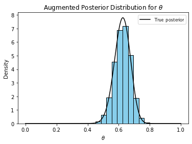
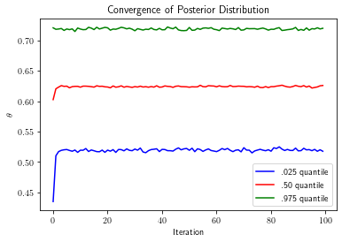

The data augmentation algorithm serves two purposes: (1) to simplify the form of an analytically intractable or complex posterior distribution, or (2) better approximate the posterior in cases where we have "incomplete" data. Here, I demonstrate the former using an example adapted from Tanner, 1996. 

As is the case for all implementations of data augmentation, we augment the observed data with unobserved, latent variables. These latent variables "complete" the observed data. Then, using both the observed and unobserved variables (the combination of which is referred to as the augmented data), we update the approximation to the posterior distribution. We repeat these two steps until the algorithm converges to the best approximation to the posterior. A concrete example best demonstrates this process. 

We consider the genetic linkage model. Suppose 197 animals are distributed into four categories as follows: $$y = (y_{1}, y_{2}, y_{3}, y_{4}) = (125, 18, 20, 34)$$ with cell probabilities $$(1/2 + \frac{\theta}{4}, \frac{1 - \theta}{4}, \frac{1 - \theta}{4}, \frac{\theta}{4}).$$ Under a flat prior, the posterior distribution is $$p(\theta | y) \propto (2 + \theta)^{y_{1}}(1 - \theta)^{y_{2} + y_{3}}\theta^{y_4}.$$ Evaluating expectations of this function might be too complex for our liking. We should sample it instead. However, we have no way to sample this distribution directly either. We can simplify its form with data augmentation. 

We augment the observed data $y$ with a latent variable $x$. We construct $x$ by spliting the first cell of $y$ into two cells. Specifically, $$y_{1} = x_{1} + x_{2}$$  $$y_{2} = x_{3}$$ $$y_{3} = x_{4}$$ $$y_{4} = x_{5}$$ where $x$ has cell probabilities $$(\frac{1}{2}, \frac{\theta}{4}, \frac{1 - \theta}{4}, \frac{1 - \theta}{4}, \frac{\theta}{4}).$$ Under a flat prior, the augmented posterior distribution is given by $$p(\theta | x) \propto \theta^{x_{2} + x_{5}}(1 - \theta)^{x_{3} + x_{4}}.$$ The augmented posterior admits a much simpler form. In fact, the augmented posterior is a beta distribution, which yields tractable expectations and direct sampling! But it depends on the latent variable $x_{2}$ which we have not yet observed. So, we must sample the conditional predictive distribution for $x_{2}$.

The conditional predictive distribution for $x_{2}$ is given by $$x_{2} \sim Binom(n = y_{1}, p = \frac{\theta}{\theta + 2}).$$ To be clear, this is the probability that a count from $y_{1}$ falls in the $x_{2}$ cell. We just divide the probability of being in $x_{2}$ by the probability of being in $x_{1}$ or $x_{2}$. 

Thus, at each iteration of the algorithm, we generate $x_{2}^{(t)}$ from the current conditional predictive distribution, i.e. $$x_{2}^{(t)} \sim Binom(n = 125, p = \frac{\theta^{*}_{(t-1)}}{(\theta^{*}_{(t-1)} + 2)}).$$. Then, we update the posterior distribution by plugging in $x_{2}^{(t)}$ into our posterior equation. We then sample $\theta^{*}_{t+1}$ from the corresponding beta distribution. We repeat this process. Once the algorithm has converged, we have a sample from the desired posterior distribution!


```python
import numpy as np
import random
import matplotlib.pyplot as plt
from scipy.stats import norm

y1, y2, y3, y4 = [125, 18, 20, 34]

numIterations = 100
numImputations = 5000
posteriorApproximations = np.zeros([numIterations, numImputations])
randomIndices = random.choices(range(numImputations), k = numIterations)
currentTheta = np.random.uniform(0, 1, numImputations)

for iiIteration in range(numIterations):

    # Display every n'th iteration

    if iiIteration % 100 == 0:
        
        print('Iteration: ', iiIteration)

    # Generate m imputations / latent variables from the current posterior distribution (represented by a sample of thetas not just one theta)

    currentImputations = np.zeros([numImputations])

    for jjImputation in range(numImputations):

        thetaStar = currentTheta[jjImputation]
        currentImputations[jjImputation] = np.random.binomial(y1, thetaStar / (thetaStar + 2), 1)

    # Now sample theta star from Beta(v1, v2) where v1 = x2 + y4 + 1 and v2 = y2 + y3

    for jjImputation in range(numImputations):

        currentLatentVariable = currentImputations[random.randint(0, numImputations - 1)] # drawn from the conditional predictive distribution given the current approximation to the posterior
        currentTheta[jjImputation] = np.random.beta(currentLatentVariable + y4 + 1, y2 + y3 + 1, 1) # sampling the current approximation to the posterior
        # (which of course depends on the latent variables that in turn depend on the previous approximation to the posterior)
        posteriorApproximations[iiIteration, jjImputation] = currentTheta[jjImputation]

    if iiIteration == (numIterations - 1):

        print('Arrived at final approximation to the posterior distribution')


## Plot the true posterior distribution as well 
        
theta = np.linspace(0, 1, 10000)
trueDensity = ((2 + theta) ** y1) * ((1 - theta) ** (y2 + y3)) * (theta ** y4)

# Normalize the true density 

deltaTheta = theta[1] - theta[0]
normalizingConstant = np.sum(deltaTheta * trueDensity)
trueDensity = trueDensity / normalizingConstant

posteriorSample = currentTheta
plt.hist(posteriorSample, density = True, color = 'skyblue', edgecolor = 'black')
plt.plot(theta, trueDensity, color = 'black', label = 'True posterior')
print('Adding labels')
plt.rc('text', usetex = True)
plt.xlabel('$\\theta$')
plt.ylabel('Density')
plt.title('Augmented Posterior Distribution for $\\theta$')
plt.legend()
plt.show()

quantiles = np.array([.025, .50, .975])
convergenceQuantiles = np.quantile(posteriorApproximations, quantiles, axis = 1) 

```

    Iteration:  0
    Arrived at final approximation to the posterior distribution
    Adding labels


    

    


We can see that the sample from the augmented posterior agrees well with the true analytical posterior. We have made use of the fact that we can easily sample a simplified posterior distribution by augmenting the observed data with latent variables. We can also see that the posterior distribution converges in just a handful of iterations below. 


```python
colors = np.array(['blue', 'red', 'green'])
labels = np.array(['.025 quantile', '.50 quantile', '.975 quantile'])

for iiQuantile in range(len(quantiles)):

    plt.plot(convergenceQuantiles[iiQuantile, :], color = colors[iiQuantile], label = labels[iiQuantile])

plt.xlabel('Iteration')
plt.rc('text', usetex = True)
plt.ylabel('$\\theta$')
plt.title('Convergence of Posterior Distribution')
plt.legend()
plt.show()
```


    

    

