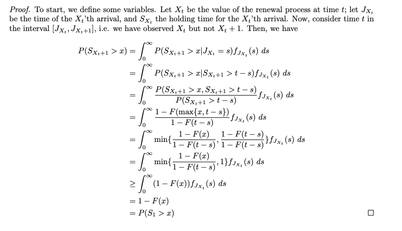

## Inspection paradox

The inspection paradox is one of my favorite results in probability theory. It says that for a renewal process with a finite average waiting time, 
an observer will spend more time waiting for the next arrival than the average waiting time itself. For example, if a bus arrives at a bus stop 
every 5 minutes on average, someone waiting to get on the bus will wait longer than 5 minutes on average. This is certainly paradoxical, but nonetheless 
feels true from experience. I prove this fact below. 

Thus, the holding time for the $X_t + 1$'th arrival is at least as large as the average first holding time, which is equal to the average holding time. 
Intuitively, if there is any variance in the distribution of holding times, the holding time for the 
$X_t + 1$'th arrival is strictly greater than the average holding time because the longer interarrival periods are oversampled, i..e there is sampling bias. 