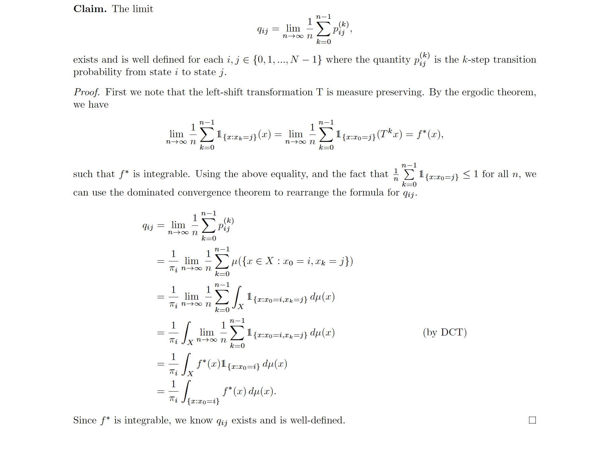

Markov chains are my primary interest in probability. We often want to know the long run proportion of time a Markov chain spends in a given state. It is not immediately clear that this quantity always exists. It could be similar to a limiting distribution in the sense that sometimes it does not exist under certain conditions. Using ergodic theory, I show that this quantity always exists. The lemma can later be used to prove the equivalence of ergodicity and irreducibility.

